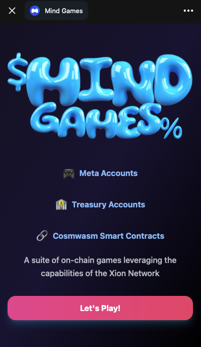
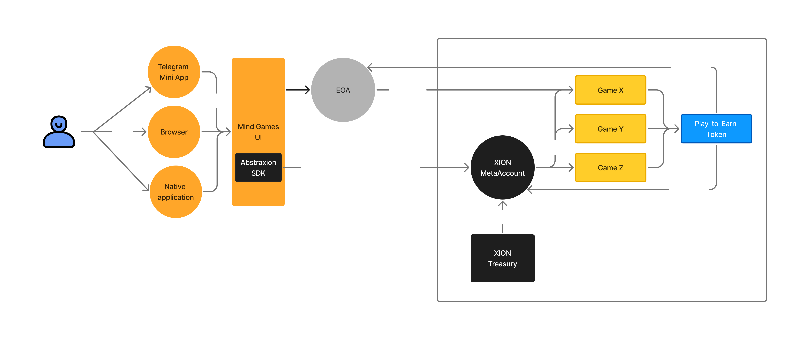

# Mindgames

A decentralized platform for playing classic game theory games, powered by CosmWasm smart contracts on the Xion blockchain.

The games can be played on the [Telegram bot](https://t.me/MindsetLabsBot) or directly in the [browser](https://mindgames.vercel.app/tg-app).



## Overview

Telegram Mindgames allows users to play famous game theory games like the Prisoner's Dilemma against other players through a familiar Telegram interface, while having all game logic and rewards handled transparently on-chain.

### Prisoner's Dilemma

The classic game of cooperation vs defection. Two players must simultaneously choose whether to cooperate with or betray each other:

- If both players cooperate, they each receive a moderate reward
- If both players defect, they each receive a small penalty
- If one player cooperates while the other defects, the defector receives a large reward while the cooperator receives a large penalty

This creates an interesting dynamic where the Nash equilibrium (both defecting) leads to worse outcomes than if both players had cooperated, but cooperation requires trust.

### Trade Gains (aka. Bargaining)

Two players must simultaneously choose how much of a reward pool they want to claim as a value from 0 to 10. If the sum of the two values is greater than 10, the game ends with both players receiving nothing. If the sum of the two values is less than or equal to 10, the game ends with both players receiving what they asked for.

Rewards are multiplied by 10 such that if a player claims 5 out of the 10 possible rewards, they receive 50 total reward tokens from the play-to-earn token contract.

### Future Games

More game theory classics will be added, such as:

- Trade Gains (aka. Bargaining)
- Rock-Paper-Scissors
- Stag Hunt
- Chicken Game
- Public Goods Game
- Ultimatum Game

## Technical Architecture



### Game Lifecycle

The platform consists of:

- A Telegram bot interface for player interactions
- CosmWasm smart contracts handling:
  - Game logic and state
  - Move validation
  - Reward distribution
- Integration with a play-to-earn token for rewards

All game moves and outcomes are recorded on-chain, ensuring complete transparency and fairness.

The way the smart contracts are designed allows for easy addition of new games, as well as the ability to add new features to existing games. Following the architecture of a [GameLifecycle Trait](https://github.com/MindsetLabs/cw-game-lifecycle/src/lifecycle.rs) which holds a default implementation for all games, each game contract must implement the trait and can override the default implementation if needed.


Each game contract is set to be an authorized minter on the play-to-earn token contract (cw20 with some extensions) to enable issuance of rewards to players once a game ends.

The GameLifecycle Trait implements a basic game state machine, which can be extended to support more complex game logic. The following diagram shows the basic state machine for the games implemented so far:


### Xion Meta Accounts & Treasury

The Xion blockchain implements [Meta Accounts](https://docs.burnt.com/xion/developers/learn/xions-meta-accounts) which allows users to login with web2 credentials (ex: email and OTP) and interact with the on-chain smart contracts.

The Xion treasury feature also allows for sponsored transactions such that users do not need to worry about paying for gas fees when playing the games.


## Run locally

### Frontend

```bash
cd frontend-game
npm install --force
npm run dev
```

Use the pre deployed contracts from the [contracts.ts](./frontend-game/src/constants/contracts.ts) file.

Or deploy your own contracts and update the [contracts.ts](./frontend-game/src/constants/contracts.ts) file with the new addresses.

### Smart Contracts

#### build the contracts

```bash
 ./scripts/optimize.sh
```

#### generate the typescript bindings

```bash
./scripts/generate.sh
```

#### deploy the contracts

For each contract run:

```bash
 xiond tx wasm store ./CONTRACT_NAME --chain-id xion-local-testnet-1 --gas-adjustment 1.3 --gas-prices 0.001uxion --gas auto --chain-id xion-testnet-1 --node https://rpc.xion-testnet-1.burnt.com:443 --from YOUR_ADDRESS
```

```bash
xiond tx wasm instantiate CODE_ID '{"base_url":"your_base_url_here","image_url":"your_image_url_here","token_contract": P2E_TOKEN_CONTRACT}' --label "contract_name" --gas-prices 0.025uxion --gas auto --gas-adjustment 1.3 -b block -y --no-admin --node https://rpc.xion-testnet-1.burnt.com:443 --chain-id xion-testnet-1 --from YOUR_ADDRESS
```
